# UCSD Robocar Using RC Controller
## Arduino Micro Pro - Leonard Compatible 22Mar23 - V2.0  
## ExpressLRS 2.4GHz (ELRS) Radio Long Range Digital  
_#Here are the radios we have for UCSD evGKart_

_#There radios use the open source ELRS_

_#There are several advantages on ELRS: Long Range Low Latency, several suppliers, software upgradable_

_#There are few options for radios. We got the radios below because they were compacts, seemed rugged, and received good reviews_

_#These radios will allow us to keep it all digital without the need to use PWM/PPM. ex: Radio UART - > Single Board Computer (SBC)._

We will use a microcontroller (MCU) to translate near real-time the protocol used on the radios into serial communication with a SBC using USB and also use the MCU for the emergency stop (off) [EMO] directly from the radio command vs. using separate radio for the EMO.

Since the radio for PPM/PWM was affordable we have one too in case we want to directly control RC Cars and or use a multiplexer as part of our EMO. This would require two PWM like cables for each radio channel used.
## BetaFPV LiteRadio 3 Pro Radio Transmitter- ELRS (Supports External Nano TX Module)
| Links | Image |
|-------|-------|
|https://betafpv.com/collections/tx/products/literadio-3-pro-radio-transmitter    https://support.betafpv.com/hc/en-us/articles/5987468200601-Manual-for-Lite-Radio3-Pro     https://www.getfpv.com/betafpv-literadio-3-pro-radio-transmitter-elrs-supports-external-nano-tx-module.html |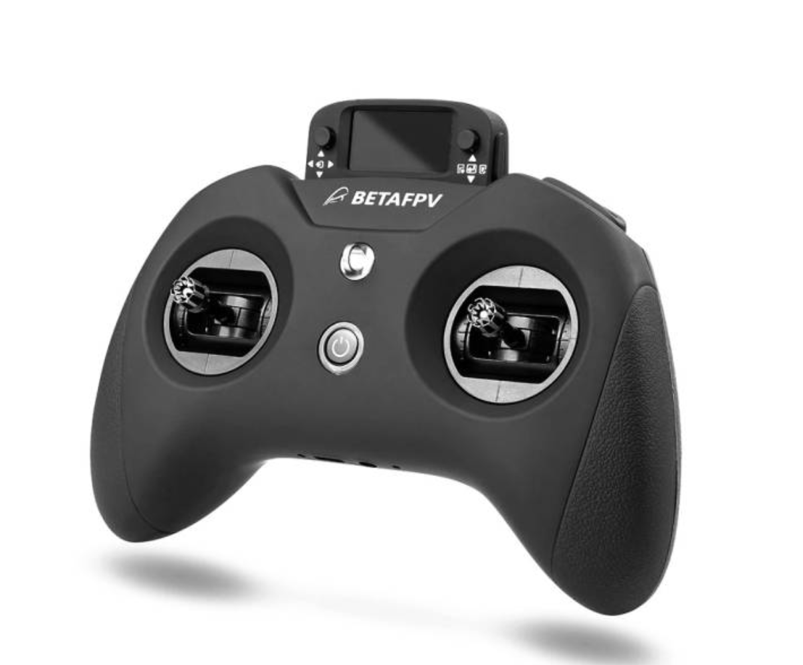 |

## MATEKSYS ExpressLRS 2.4GHz Receiver - ELRS R24 D

| Links | Image |
|-------|-------|
|https://www.getfpv.com/mateksys-expresslrs-2-4ghz-receiver-elrs-r24-d.html|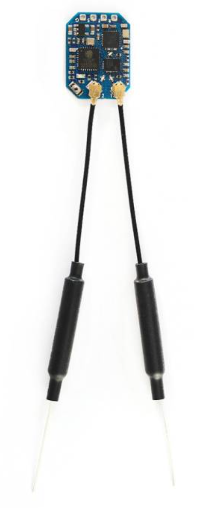 |

## MATEKSYS ExpressLRS 2.4GHz Receiver - PWM ELRS-R24-P6

| Links | Image |
|-------|-------|
|https://www.getfpv.com/mateksys-expresslrs-2-4ghz-receiver-pwm-elrs-r24-p6.html|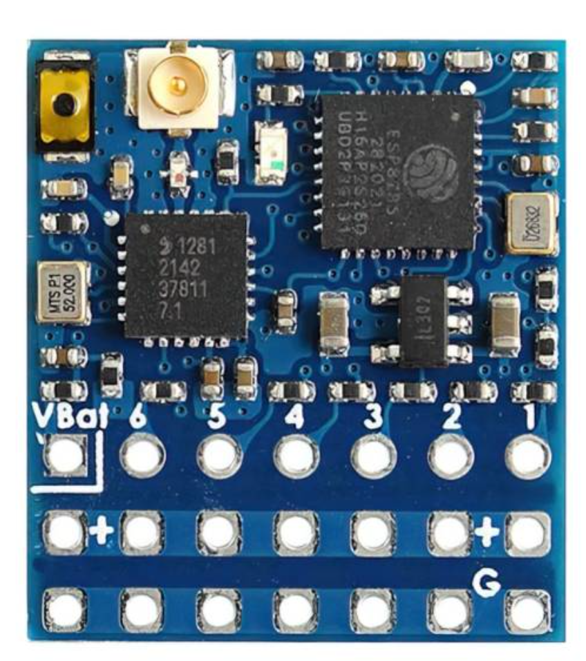 |

## Upgrading the ELRS firmware
24Mar23

_#Get back to revise these to show version  3.2.0 again._

I had to use 3.2.0 because it is the version that ELRS configurator has for the receiver. It seems I need to keep the ERLSv2.luna vs3 for the radio to read the luna script. I hope they will fix it in the future.

_#There is a good software that helps on on the upgrade   https://www.expresslrs.org/quick-start/installing-configurator/

_#They support Windows, Mac, and Linux_

_#Ideally you upgrade the radios Tx and Rx on the same session to make sure they have the same firmware version_

_#Also if you have multiple of the same Tx and Rx doing them consecutively can save you time and help reduce the risk of having different firmware versions._

_#For the BETA FPV 3 PRO_   https://www.expresslrs.org/quick-start/transmitters/betfpvlr3pro/

_#Turn on the TX radio_ 
_#Plum the USB C cable connected to your computer_ 
_#The radio will ask what connection to use_ 
_#Select USB Serial (Debug)_ 
_#You will need to look for the Radio in the connections options_

_#Version 2.5.2_
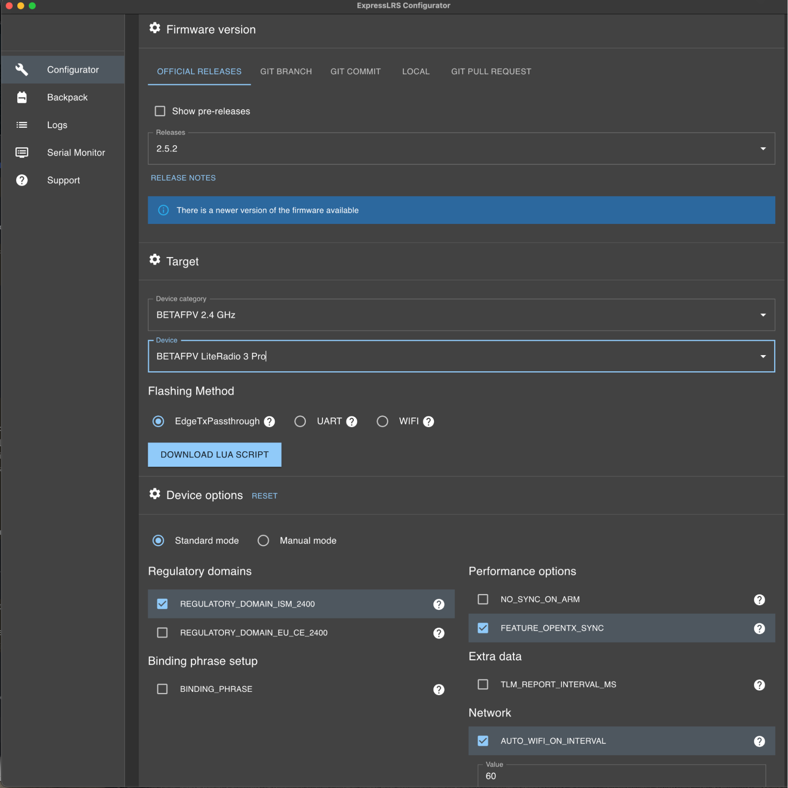

_#Build & Flash_ 
_#The first time it will take a while to download, install tools and build the firmware_

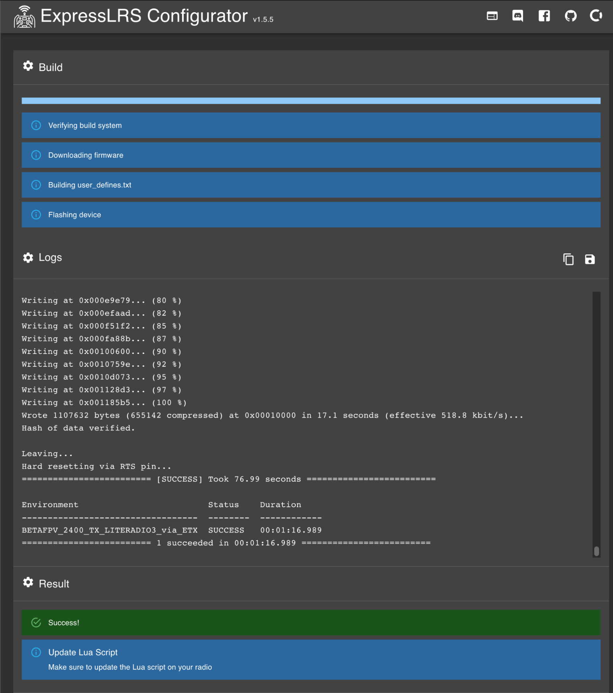 

_#Download and save on your computer the the LUA Script file_ 
_#Unplug the USB cable, turn off the radio, turn on again_
  
_#To upload the LUA script to the radio, unplug the USB cable if connected, connect it again_ 
_#Select USB Storage (SD)_ 
_#Then you can use your computer to upload the LUA script you saved earlier_ 
https://www.expresslrs.org/quick-start/transmitters/lua-howto/
  
Download the ELRSv3 Lua Script (you can simply right-click, save-as) into your radio's SD Card under the Scripts/Tools

 

  
_#elrsV2.lua_ 
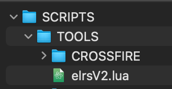  
_#Also, let's delete the older .lua script from the root of the DISK_IMG of the radio_
  
_#Remove the USB cable from the radio_ 
_#Hold the right top joystick to the left for 1~2 seconds_ 
_#Tools_ 
_#EspressLRS_ 
_#See if the configuration loads, here is where I have problems with V3.x for some problem. V2.5.2 works just fine_
  
_#The BetaFPV LiteRadio 3 Pro Radio Transmitter uses the two smaller joystick to navigate the configuration menu
Moving the right side change the GUI on the display
Moving the right side to the left and holding it for few seconds get you into the settings_

## Receiver MATEKYS R24-D 2.4Ghz
https://www.expresslrs.org/quick-start/receivers/matek2400/ 
  
If this is the first time you're flashing/updating your receiver or you're updating it from a previous 2.x firmware via WiFi, first ensure that it has version 2.5.2. Once it has the 2.5.2 flashed, update to 3.x.
  
_#Connect to the Wifi Network the receiver has created. It should be named something like ExpressLRS RX with the same expresslrs password as the TX Module Hotspot._ 
_#After the Rx radio boots, wait to see the LED flashing quick. That is an indicadion that its Access Point and web server is running._ 
_#Using a web browser_ 
http://10.0.0.1/  
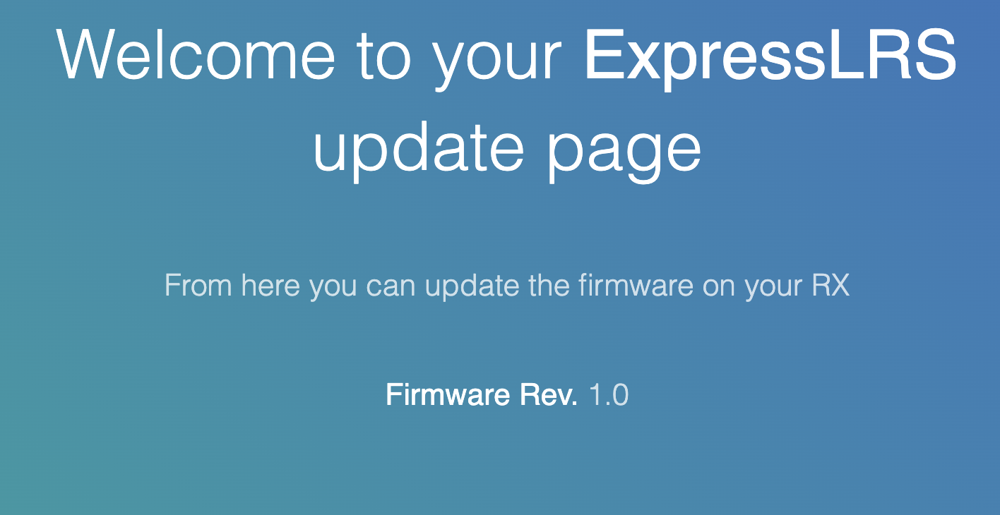 
 
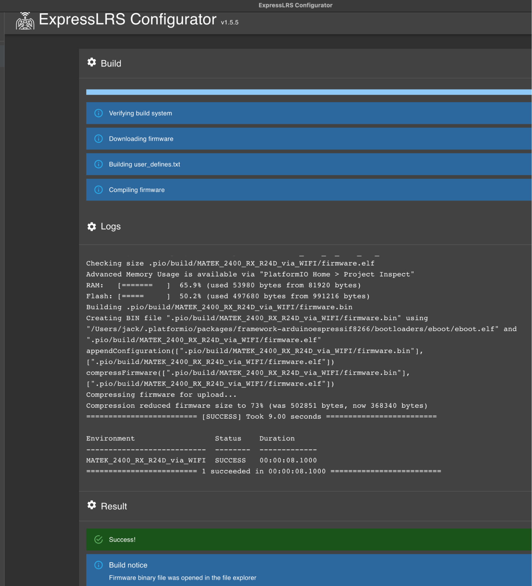 
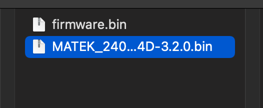
  
_#Connect to the website of the device and upload new firmware_ 

  
Then if you connect the receiver to your local WiFi you can get to it by usings its IP address or name. You can scan the network and look for a device called elrs_rx
  
ex:  http://elrs_rx.local
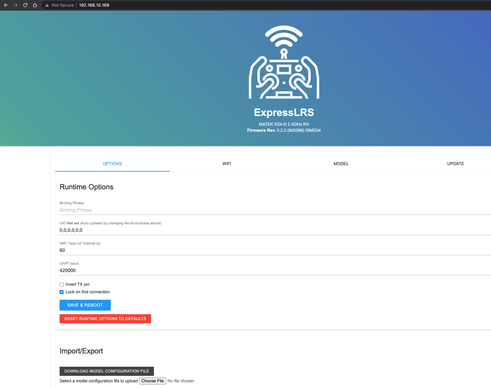
  
_#Because we will be on the field and not necessarily close to WiFi, let’s leave the AP of the radio on so we can configure it. Not very safe since someone can connect to it while the AP is on. We will check how to protect it with a  password on it a bit later.
Moreover, I did not see how to name the radios, it would be hard to know what Rx radios is what in the network._ 
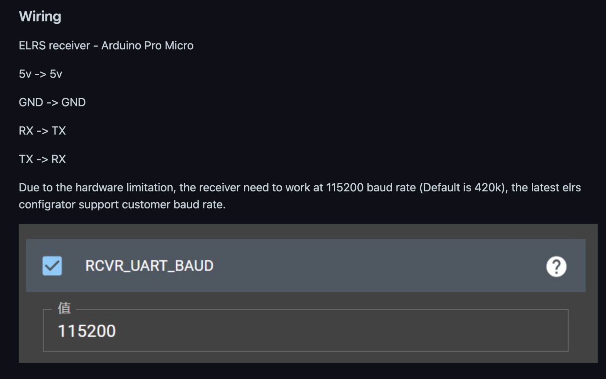
  
_#Let's get the Rx to be on 115200 baud rate_ 
_#Just connect to the webinterface of the Rx and set the baudrate_ 
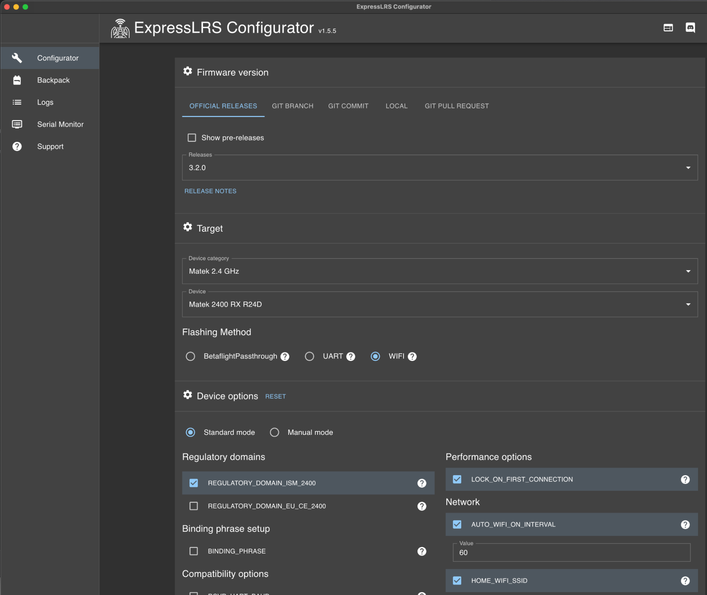
  
_#We need to use a USB to TTL cable - [example from Amazon](https://www.amazon.com/DaFuRui-3Pack-PL2303TA-Serial-Console/dp/B08BF6ML1V/ref=sr_1_2_sspa?crid=1GTFAL8DU80F4&keywords=USB+to+TTL&qid=1679591543&sprefix=usb+to+ttl%2Caps%2C142&sr=8-2-spons&psc=1&spLa=ZW5jcnlwdGVkUXVhbGlmaWVyPUFWSjBSODZZNkVNUFMmZW5jcnlwdGVkSWQ9QTA4NTIwNDIzMEpTWU1MN1JHWkYmZW5jcnlwdGVkQWRJZD1BMDUwMDE0MDJDNEI5S1hYU0g3NlQmd2lkZ2V0TmFtZT1zcF9hdGYmYWN0aW9uPWNsaWNrUmVkaXJlY3QmZG9Ob3RMb2dDbGljaz10cnVl)_ 
 
_#Or you can use the embedded WiFi, how cool is that?_ 

  
Lets try the UART first

Red wire of the USB to TTL = + 
Black wire of the USB to TTL = - 
Green = 
White =  

_#Press and hold the boot button while connecting the USB to TTL device to your computer_ 
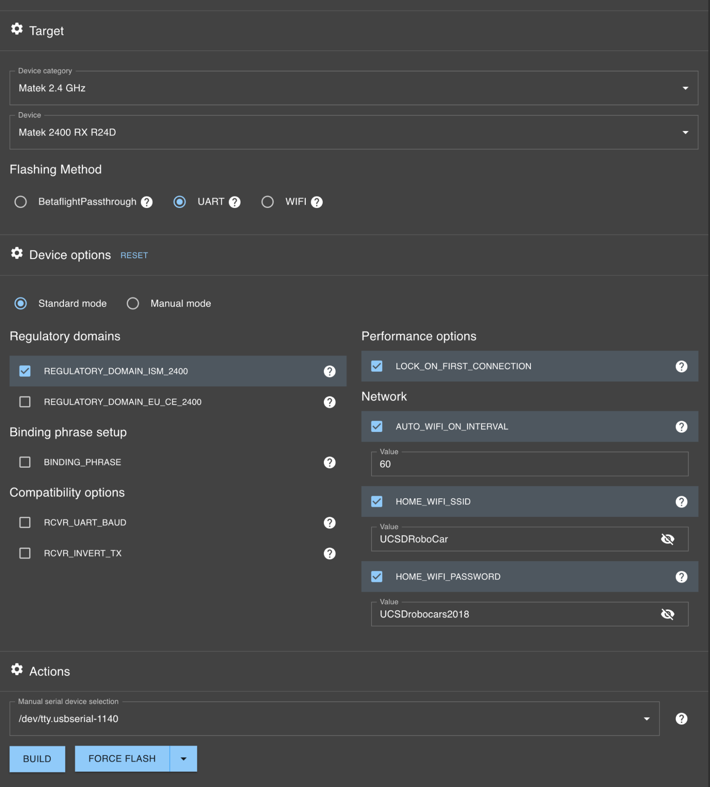 
http://www.mateksys.com/?portfolio=elrs-r24#tab-id-3 
For ELRS-R24-D, if update from 2.x to 3.x, Pls select target MATEK 2400 RX R24D and click on Force Flash
  https://github.com/kkbin505/Simple_RX

- Readme.md

- CRSF decode library for arduino atmega32u4/328p.

- Based on arduino SBUS decode, modified to decode crsf protocol from elrs receiver

_#Let's keep it simple first just by using Arduinos, then we will try a Raspberry PI Pico, and then UCSD DRTC if we want to make everything CAN_ 
https://www.amazon.com/gp/product/B09C5H78BP/ref=ppx_yo_dt_b_asin_title_o01_s02?ie=UTF8&psc=1 

  
_#I got this coming too so we use a better USB connector, USB C vs. uUSB._ 
_#I just did not see there was a version with USB C earlier._ 
https://www.amazon.com/gp/product/B0BCW67NJP/ref=ppx_yo_dt_b_asin_title_o00_s00?ie=UTF8&psc=1 

  
https://github.com/kkbin505/Simple_RX  
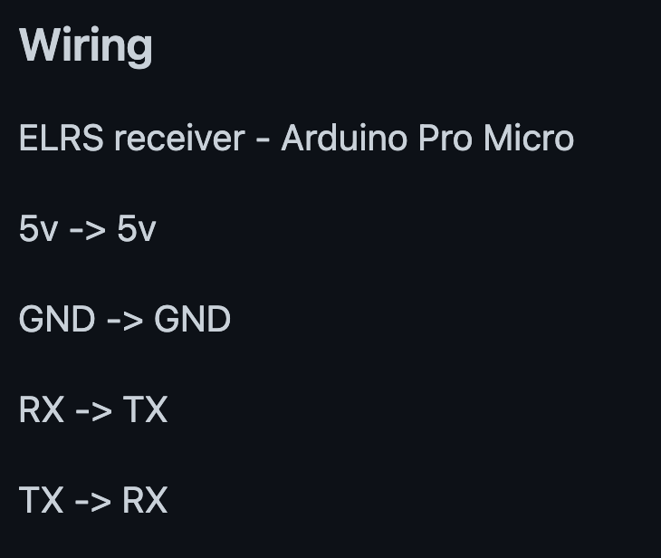 

  
## Some Background and References ELRS Radio (Long Range Digital)
TCIII — 03/17/2023 1:11 PM
Hi Jack. I spent half of today learning about how to update (flash) the BETAFPV gamepad/plug-in transmitter/receiver software.
Both the gamepad or the plug-in transmitter software version has to be the same as the receiver and vice versa.
The gamepad configuration and update flashing can be done with the BETAFPV Configurator while even BETAFPV uses the ELRS Configurator to update the plug-in transmitter and receiver.
Nothing like consistency. 😄
The BETAFPV LiteRadio 3 gamepad RC transmitter can output 25, 50, or 100 mw while the plug-in RC transmitter can output 100, 250, or 500 mw and comes with ELRS version 2.01. 
The Matek ELRS six channel PWM receiver comes with ELRS version 3.0 while the BETAFPV Nano serial output receiver comes with ELRS version 1.0.0-RC5 so I am going to have to reprogram both receivers with ELRS version 2.01.
These LoRa gamepads and receivers are definitely not for beginners. 😲
TCIII — Yesterday at 7:06 AM
Hi Jack. I think that it would be best to converse about the Expresslrs LoRa gamepad project on DM until we get the circuitry and software validated, otherwise we might wind up with DC Users trying to implement a LoRa gamepad system that has not been full vetted for functionality and have substantial issues.
TCIII — Yesterday at 7:25 AM
Hi Jack. I bought a couple of Arduino Pro Micros so that I could use the crsf_decode_hid.ino sketch from https://github.com/kkbin505/Simple_RX
The sketch compiled just fine after I installed the additional required libraries and I will connect the serial output of the BetaFPV serial output Nano receiver to the Pro Micro and see what kind of output I get using the serial monitor.
The Arduino Joystick Library (https://github.com/MHeironimus/ArduinoJoystic+kLibrary) is used by the crsf_decode_hid.ino sketch, but the included sketches in the library are designed to take individual joystick and button inputs connected to the Pro Micro and and produce a HID joystick that can be used by PCs for games.

Could you please take a look at the crsf_decode_hid.ino sketch as I understand the debug portion, but I don't see where he is outputting the decoded crsf gamepad joystick/button HID values on the USB port.
If the crsf_decode_hid.ino sketch is really making the Nano Receiver crsf output look like a HID gamepad then we have it made, though it does require the Pro Micro to interface the Receiver to the SBC as an HID device. 🙂

I am using a BetaFPV LiteRadio 3 RC gamepad to do the testing compared to your BetFPV LiteRadio 3 Pro.
All of the BetaFPV products are still using Expresslrs version 2.x when Expresslrs version 3.x is now available.
The BetaFPV LiteRadio 3 can only be programmed with the BetaFPV Configurator so that gamepad is limited to Expresslrs version 2.x where as your BetFPV LiteRadio 3 Pro can be programmed with the Expresslrs Configurator and can be programmed with Expresslrs 3.x.
Remember, both the RC gamepad and the receiver must have the same software version of Expresslrs and pass phrase to bind correctly.
GitHub
GitHub - kkbin505/Simple_RX: crsf protocol decode for avr
crsf protocol decode for avr. Contribute to kkbin505/Simple_RX development by creating an account on GitHub.
GitHub - kkbin505/Simple_RX: crsf protocol decode for avr
GitHub
GitHub - MHeironimus/ArduinoJoystickLibrary: An Arduino library tha...
An Arduino library that adds one or more joysticks to the list of HID devices an Arduino Leonardo or Arduino Micro can support. - GitHub - MHeironimus/ArduinoJoystickLibrary: An Arduino library tha...
GitHub - MHeironimus/ArduinoJoystickLibrary: An Arduino library tha...

This afternoon I will try to determine the voltage of the BetaFPV Nano serial channel receiver output.
It will either be 5 vdc or 3.3 vdc.
The Nano receiver is powered by 5 vdc, but there is a 3.3 vdc on the Nano receiver pwb because the receiver/processor and WIFI ICs work on 3.3 vdc.
So it would seem to me that the serial channel is a 3.3 vdc signal output which will be compatible with either the Rpi or Nano GPIO bus for onboard crsf decoding.
Though I like the fact that the Pro Micro, when programmed with the crsf_decode_hid.ino sketch looks just like a HID compliant game controller which makes it portable between RC cars.
Additionally the Joystick Descriptor in the crsf_decode_hid.ino sketch allows the customizing of the crsf data stream as to the type of LoRa game controller in use. 
TCIII — Yesterday at 9:53 AM
Observations concerning BetaFPV Expresslrs products:
1. Only the BetaFPV LiteRadio 3 Pro can be programmed with the Expresslrs Configurator, unlike the LiteRadio 3 and the LiteRadio 2 SE which require the BetaFPV Configurator, which allows access to the latest Expresslrs version 3.x.
2. The LiteRadio 3 and the LiteRadio 2 SE must programmed with the BetaFPV Configurator because they use a custom version of Expresslrs which is stuck at version 2.x.🙁 
3. All of the BetaFPV receivers can be programmed with the Expresslrs Configurator, but keep in mind that both the BetaFPV RC gamepads and receivers must have the same version of the software and pass phrase to bind.
4. Therefore if you are using a LiteRadio 3 or a LiteRadio 2 SE, you cannot upgrade the software of any of the BetaFPV receivers to Expresslrs 3.x or you will lose binding capability.
5. The default baud rate of the BetaFPV Nano serial channel receiver UART is 420000 baud so I had to use the Expresslrs Configurator to change the Nano receiver's UART baud rate to 115200 baud to work with the Pro Micro.
6. Unfortunately the Expresslrs Configurator will only show Expresslrs version 2.5 and up for flashing and the Nano receiver for my purposes needed software version 2.x to update the UART baud rate.
7. Fortunately the Expresslrs Configurator allows access to the Expresslrs software version archives so I could use Expresslrs version 2.0 to update the UART baud rate. 🙂 
  
Since I bought the BetaFPV LiteRadio 3, which has an external transmitter port, I also purchased the BetaFPV Nano RF TX Module that can be programmed with the Expresslrs Configurator fortunately.
The stock BetaFPV LiteRadio 3 has an output of 100 mw while the BetaFPV Nano RF TX Module can be programmed for outputs of 100, 250, and 500 mw.
The higher transmitter output power will obviously result in shortened battery run times and are probably not necessary as 100 mw can be good for over 10 km LOS. 😄
JackSilb — Yesterday at 10:02 AM
You need a USB to TTL to connect it to a Jetson Nano or RPI USB no? Unless you want go direct into the I/Os.
TCIII — Yesterday at 10:06 AM
Using the Pro Micro programmed with the crsf_decode_hid.ino sketch allows the BetaFPV Nano serial channel receiver appear to be a HID compliant game controller, like a BT gamepad, to either the Rpi or the Nano without any additional hardware.
JackSilb — Yesterday at 10:06 AM
I have the Lite Radio 3 Pro with the cute small display. That will be useful for displaying some info.
JackSilb — Yesterday at 10:07 AM
We had something similar for the Teensy too. Stopped using it once we got the VESCs.
TCIII — Yesterday at 10:07 AM
That is excellent as you can program any BetaFPV receiver with the latest Expresslrs software.
JackSilb — Yesterday at 10:08 AM
Here is the design challenge. If you are using the ELRS radio UART direct to the JTN (Jetson Nano) or RPI and from there USB or Can to the VESC, how can we use the Multiplexer for the EMO. That works only for PWM.
On the VESC you can configure a pin for a EMO, we would need a I/O from the Rx radio to bring it 1/0 for EMO direct into the VESC vs. using the JTN or RPI. Ideally, I will find a Rx radio with UART and some I/O capability that I can use a channel, lets say Channel 4 as the EMO switch.
JackSilb — Yesterday at 10:21 AM
Maybe this is I can pass the UART info along. Use the PWM for the EMO on/off (1/0) at the VESC
TCIII — Yesterday at 10:31 AM
The UART data is in crsf format and will need to be decoded using a Python Program: https://pypi.org/project/crsf-parser/
There are multichannel BetaFPV Expresslrs PWM receivers and I have one: https://www.amazon.com/BETAFPV-ExpressLRS-Compatible-Multirotors-Helicopters/dp/B09WHLJ2GN/ref=sr_1_2?crid=17HV1H415IRJR&keywords=BETAFPV+ExpressLRS+Micro+Receiver&qid=1679420003&sprefix=betafpv+expresslrs+micro+receiver%2Caps%2C107&sr=8-2 
PyPI
crsf-parser
A package to parse and create CRSF (Crossfire) frames, developed primarily to interoperate with ExpressLRS
Image
BETAFPV ExpressLRS Micro Receiver Support 5 CH PWM Outputs Failsafe...
Binding Procedure The Micro receiver comes with officially major release V2.0.0 protocol and has not been set for a Binding Phrase. So please make sure the RF TX module works on officially major release V2.0.0 protocol and no Binding Phrase has been set beforehand. Enter binding mode by plugging ...
JackSilb — Yesterday at 10:42 AM
I guess we can do this with ELRS UART -> Arduino or Teensy USB HID -> JTN or RPI  and Arduino or Teensy I/O to the disable pin of the VESC. As long as the Arduino / Teensy code is solid and we have a watchdog we should be good. Adding the MCU in the mix get us going with lots of future opportunities...
I need this for our evGoKart ASAP. I need to get some time to play with me. Lots of work(x2) on on the way
Do you want me to share with you our work using the Teensy 4.0 including the PCB?  I can send you a PCB too.
TCIII — Yesterday at 10:45 AM
I will have more time on Wednesday to test out the Pro Micro setup with the BetaFPV LoRa gamepad and receiver and get back to you with the results.
TCIII — Yesterday at 10:46 AM
Address:
11859 SE 91st Circle, Summerfield, FL 34491.
JackSilb — Yesterday at 10:47 AM
Can we do the Arduino code to be compatible with the Raspberry Pico? https://www.youtube.com/watch?v=Q97bFwjQ_vQ
YouTube
Jan Lunge
Pi Pico + KMK = the perfect combo for Custom Keyboards
Image
https://www.youtube.com/watch?v=__QZQEOG6tA
YouTube
Print 'N Play
Use A Raspberry Pi Pico as a HID [Gamepad, Keyboard, Mouse, and Mul...
Image
Probably a better HW than Arduino Pro Micro
TCIII — Yesterday at 10:56 AM
Probably as the Arduino sketch code is C++.
JackSilb — Yesterday at 11:04 AM
I purchased few of the Arduinos and Raspberry PI to experiment.
Image
Charging the controller already. We go from there.
JackSilb — Yesterday at 11:12 AM
Yeah, I have a similar from MATEKSYS too. At UCSD, I went away from the PWMs. We go from the JTN to the VESC using USB. The VESC can use the PPM input as output to drive a servo.
My current need is for the autonomous evGoKart. Talking you made me find a solution for long distance EMO cheap vs. using the long range telemetry 3DR like only for the EMO. We were using it for the JoStick too with a ROS application on an RPI. Too complex.
I will give a try using 
ELRS UART -> (Arduino Pro Micro or Teensy or Raspberry PICO) USB HID -> USB (Jetson or RPI)  and (Arduino Pro Micro or Teensy or Raspberry PICO) I/O to the disable pin of the VESCs. We have one VESC for the throttle and one for the steering.
TCIII — Yesterday at 11:34 AM
I have a whole bunch of 3DR Telemetry Transceivers on 915 Mhz. 🙂 
They were only good for LOS even at 100 mw and highly directional too. 🙁
TCIII — Yesterday at 11:38 AM
I bought three of the Hiltego Arduino Pro Micros to work with the BetaFPV Nano receiver and all three programmed just fine with a Sparkfun version of Blinky as a test of their functionality. 🙂
I have one Rpi PICO that Ed convinced me to buy as it it very fast compare to the Arduino Minis. 
REMEMBER that the BetaFPV LiteRadio 3 and the Pro must have the left joystick in the down position when you turn them on or they will buzz and flash the power button RED.
As a result of this characteristic, don't energize your car ESC until you have the left joystick at the neutral position (assuming Mode 2) which is basically straight up or your car will go into reverse at full speed.😲 
TCIII — Today at 6:16 AM
Hi Jack. I measured the Nano receiver serial output signal voltage with my digital o'scope this morning and it appears to be 3.43 v which should be safe as an input to either the Nano or the Rpi GPIO bus for direct decoding of the crsf signal.
TCIII — Today at 7:19 AM
Hi Jack. I connected the BetaFPV Nano serial output receiver to the Rx input of the Pico Micro running the crsf_decode_hid.ino sketch and viewed the Pico Micro USB HID output in the PC Game Controller Panel "game controller settings".
I have the RC gamepad frame rate set at the default 150 frames/sec and the joystick display responses are virtually instantaneous and smooth unlike some gamepads. 🙂 
The "+" cursor in the X Axis / Y Axis box is presently controlled by the right joystick horizontal and vertical axes though the "+" moves in the opposite direction from the joystick direction of the vertical axis on the gamepad while the left joystick vertical axis (throttle) controls the Z axis red bar and the horizontal axis controls the X axis rotation.
The gamepad left push on push off SA switch controls the Y rotation red bar while the left three way switch SB controls the Z rotation red bar. 
Observations concerning the Joystick axes and switches definitions:

The Joystick HID descriptor report, shown below, controls the definition of the joystick axes and switches:

Joystick_ Joystick(JOYSTICK_DEFAULT_REPORT_ID,JOYSTICK_TYPE_GAMEPAD,
  0, 0,                 // Button Count, Hat Switch Count
  true, true, true,  // X, Y, Z
  true, true, true,  // Rx, Ry, Rz
  false, false,          // Rudder, Throttle
  false, false, false);    // Accelerator, Brake, Steering

Based on a search of the IoT for information concerning the HID descriptor report, the HID descriptor shown above does not match any of the HID descriptor report documentation I could find.
I suspect that the HID descriptor report shown above is unique to the Arduino Joystick Library requirements and we need to understand how to modify the HID descriptor report to meet the DC BT gamepad joystick/button requirements.
TCIII — Today at 8:05 AM
So we now have a choice on how we connect the LoRa RC gamepad receivers to our SBCs:

1. Connect the Nano receiver UART serial output to a serial Rx pin on the SBC GPIO bus and create a part (https://pypi.org/project/crsf-parser/) that mimics a joystick gamepad or

2. Connect the Nano receiver UART serial output to a Pico Micro running the crsf_decode_hid.ino sketch which makes the crsf output of the Nano receiver look like a HID gamepad (game controller) though it might require some modification of the Joystick HID descriptor report in the sketch to get the RC gamepad to work with DC as a BT gamepad.

Comments? 
PyPI
crsf-parser
A package to parse and create CRSF (Crossfire) frames, developed primarily to interoperate with ExpressLRS
Image
TCIII — Today at 10:23 AM
Hi Jack. Do you think that any of your graduate students would be interested in writing a DC part to decode the crsf data stream frames and provide functional gamepad output? 🙂
If so, I will be glad to work with them. 
TCIII — Today at 11:30 AM
I don't think that the Micro HID output looks completely like a PS4/XBox gamepad so the HID joystick descriptor report will probably have to be adjusted to look like a standard gamepad.
Since there is no CONTROLLER_TYPE = defined for this HID RC gamepad, Users will have to use the Joystick Wizard to create a custom joystick?

One of the issue I see is that LoRa RC gamepads are Mode 2 gamepads where the throttle is on the left joystick and the steering is on the right joystick. 🙁 
A standard BT gamepad is a Mode 1 gamepad where the throttle is on the right joystick and the steering is on the left joystick.
TCIII — Today at 12:22 PM
I suspect that the only way that this LoRa RC gamepad is really going to be really "user transparent" is to create a part that decodes and process the crsf serial data stream to create a standard gamepad? 
TCIII — Today at 12:42 PM
Hi Jack. Here is a tutorial on how to use an RC Radio transmitter as a gamepad controller: https://www.plop.at/en/rc.html
It might give us some insight on modifying, if necessary, the crsf_decode_hid.ino sketch to simulate a generic gamepad?
I have contacted the author of the crsf_decode_hid.ino sketch about the joystick HID descriptor report that he used and how he created it.
TCIII — Today at 1:39 PM
Hi Jack. Attached is a screen shot of what the output of the RC Gamepad/Pro Micro USB HID Game Controller Panel looks like.
The "+" cursor in the X Axis / Y Axis box is presently controlled by the right joystick horizontal (Steering) and vertical axes though the "+" moves in the opposite direction from the joystick direction of the vertical axis on the gamepad while the left joystick vertical axis (Throttle) controls the Z axis red bar and the horizontal axis controls the X axis rotation.
The gamepad left push on push off SA switch controls the Y rotation red bar while the left three way switch SB controls the Z rotation red bar.
Image
  
## Some background and References PWM PPM

Hi guys, I have a question about modifying the controller for the donkey car base on this link https://docs.google.com/document/d/1yx1mF0dgEHLx5S3Vqss8YFFkW4thCrl9fpgVliHcuhw/edit  we are able to get the signals from controller to the Arduino after modifying the controller, but now we need to know how to connect the Arduino Leonardo to PWM.

Ehsan, the Arduino connects to the JTN or RPI. The PWM board does not change until we have the Teensy in the loop. Therefore, the PWM board is the same. It uses I2C to communicate with the JTN or RPI. That is why it is not in the instructions.

Basically the Arduino is simulating a JS0 (Joystick) in a Linux machine. It converts PWM signals from the RC controllers as it was a Game/Pad Joystick. The PWM board is still the same, nothing changes.

You need to get the latest Donkey, 3.1.1 if I am not mistaken, and change the Joystick Type on myconfig.py along with your calibration values, Webcam, and use channel 1 for steering, channel 2 for Throttle.

The only difference on the myconfig.py for using the Arudino (Leonardo) simulating the Joystick is the setting on the Joystick/game controller type. Everything else is as you were using a regular Donkey setup.

https://github.com/n6wxd/wireless-rc-adapter/blob/master/wireless-rc-adapter-2.1/src/PinChangeInterrupt/README.md
  
Arduino Uno/Nano/Mini: All pins are usable 
Arduino Mega: 10, 11, 12, 13, 50, 51, 52, 53, A8 (62), A9 (63), A10 (64),
A11 (65), A12 (66), A13 (67), A14 (68), A15 (69) 
 Arduino Leonardo/Micro: 8, 9, 10, 11, 14 (MISO), 15 (SCK), 16 (MOSI) 
 HoodLoader2: All (broken out 1-7) pins are usable 
 Attiny 24/44/84: All pins are usable 
 Attiny 25/45/85: All pins are usable 
 Attiny 13: All pins are usable 
 Attiny 441/841: All pins are usable 
 ATmega644P/ATmega1284P: All pins are usable
  
Arduino Leonardo/Micro allows interrupts on : 8, 9, 10, 11, 14 (MISO), 15 (SCK), 16 (MOSI)
So, let’s use 8, 9, 10

https://github.com/n6wxd/wireless-rc-adapter/blob/master/wireless-rc-adapter-2.1/pwm.ino

#elif defined(ARDUINO_AVR_MICRO) || defined(ARDUINO_AVR_LEONARDO) 
    const uint8_t RC_PINS[6] = {11, 10, 9, 8, PB2, PB1};

https://github.com/n6wxd/wireless-rc-adapter
https://github.com/wireless-rc-adapter/wireless-rc-adapter/wiki
